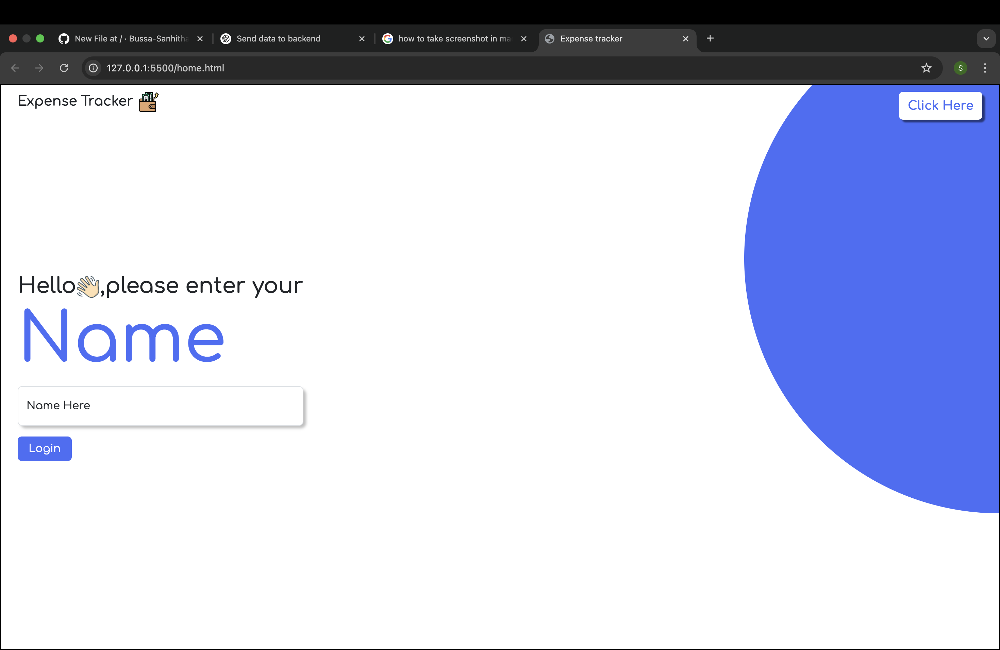

<h1>💸 Expense Tracker</h1>

A responsive Expense Tracker web app that allows users to log income and expenses, view transaction history, and delete transactions.
Designed for both desktop and mobile devices.

✅ Built with HTML, CSS, JavaScript.

<h1>🌟 Features:</h1>

           📥 Add income and expense transactions

           📜 View all transactions in a dynamic table

           🗑️ Delete individual transactions

           📱 Fully responsive design (mobile + desktop)
<h1>🖼️ Screenshots:</h1>
<h4>Home Page in Desktop view:</h4>

<h4>Tracker page in desktop view:</h4>

<h4>Home Page in mobile view:</h4>

<h4>Tracker page in mobile view:</h4>

<h1>⚙️ Tech Stack:</h1>

Frontend:	HTML, CSS (responsive), JavaScript

<h1>📱 Responsive Design:</h1>

The UI uses CSS Flexbox and break points to ensure a smooth experience on both desktop and mobile. 
Transaction table and form elements adjust for smaller screens.

